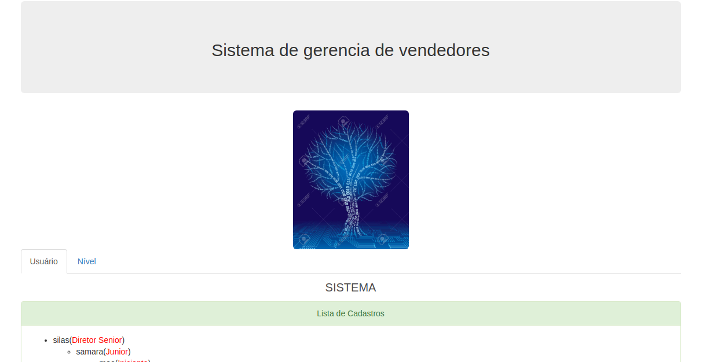

# Renato Lucena - sistema de arvore binaria

	Binary-Vendedores

## PHP + MYSQL
- Pode criar um usuario  e fazer um ligação de usuarios indicado por vc
- pagina de login tem a palavra teste em vermelho com a senha de teste para voce testar o sistema de forma simples e objetiva com um nivel crescente.
- Ah cada ususario novo, voce tera um nivel no sistema. 
- Usario admin: cpdrenato@gmail.com, senha: teste
- Usuario simples: teste@teste.com, senha: teste
 - sql para vc executar
 - configurar banco mysql no arquivo config.php

- 12/2018